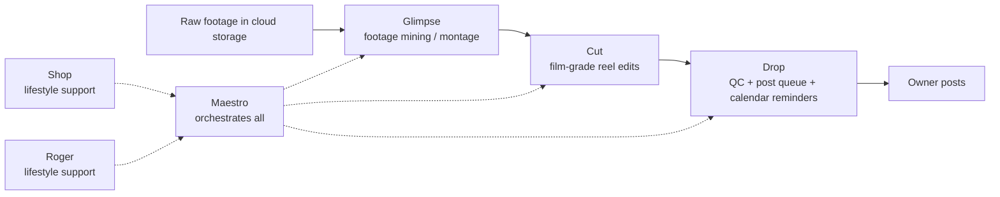

# AI-Agent Content Production Pipeline

A professional, human-approved pipeline for turning original footage into polished short-form video. Specialized agents mine footage, shape edits, run quality control, and prepare a post queue while an orchestrator keeps handoffs explicit and reviewable. The owner always makes the final publishing decision for the channel.

## Agents

| Agent | Role | Inputs | Outputs |
|---|---|---|---|
| Maestro | Orchestrates the workflow and handoffs | Briefs, status, approvals | Routed tasks, run state |
| Glimpse | Mines footage and builds montages | Original footage, brief | Selects, montage brief |
| Cut | Produces film-grade reel edits | Selects, edit brief | Review render |
| Drop | Runs QC and prepares publishing | Review render, caption brief | Approved queue item, reminder |
| Shop | Supports lifestyle/product context | Product brief, source assets | Context notes |
| Roger | Supports lifestyle storytelling | Story brief, source assets | Story notes |

## Design principles

- **Human in the loop:** nothing posts or sends without owner approval.
- **Original footage only:** use source material with clear provenance.
- **QC gates:** every handoff must pass technical and editorial checks.
- **Single-pass renders:** avoid avoidable generations and preserve reviewability.
- **Family-friendly:** keep concepts, language, and outputs broadly suitable.

## Pipeline

## Principles in practice

Agents exchange concise briefs and reviewable artifacts rather than opaque state. Cloud storage holds source and renders; calendar reminders support scheduling; publication remains an explicit owner action.
